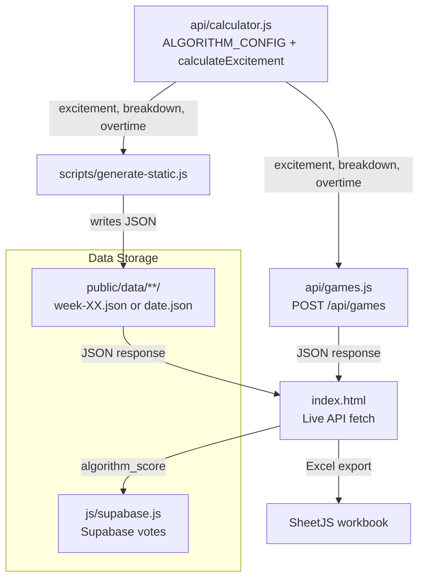

# Algorithm Change Impact Analysis

## Purpose
This document maps every dependency on the entertainment scoring algorithm output so future updates can be made safely without breaking downstream systems.

## Dependency Diagram (Data Flow)


## Data Flow Mapping (Node-by-Node)

### Shared configuration (single source of truth)
**Source**: `js/algorithm-config.js`
- Defines `scale`, `tiers`, `weights`, `thresholds`, `bonuses`, `metrics`, and `precision`.
- Exposes `getTier(score)` helper.

**Frontend consumption**
- Classic script tag loads `js/algorithm-config.js`, which attaches:
  - `window.ALGORITHM_CONFIG`
  - `window.getTier`

**Backend consumption**
- Node ESM uses `createRequire()` to load the CommonJS config from `js/algorithm-config.js`.

### 1) `api/calculator.js` (source)
**Outputs**: `excitement` (1–10), `breakdown` `{uncertainty, drama, finish}` (0–10), `overtime` passthrough (boolean), plus game metadata.
- **Where it happens**: `analyzeGameEntertainment` returns the output object with `excitement`, `breakdown`, `overtime` (`api/calculator.js` lines 49–59).
- **Transformations**:
  - Weighted combination of metrics (`weights`), overtime bonus, then normalization to 1–10 (`api/calculator.js` lines 96–114).
  - Subscores are 0–10 before weighting (`api/calculator.js` lines 80–94).
- **Break risk**:
  - Changing field names (`excitement`, `breakdown`, `overtime`) breaks API responses, static JSON schema, frontend UI, exports, and vote storage.
  - Changing output ranges impacts UI tier thresholds, radar chart scaling, pie chart fill, and exports.
  - Rounding precision is centralized (`ALGORITHM_CONFIG.precision.decimals`); updating it changes display, exports, and stored vote comparisons.

### 2) `api/games.js` (API endpoint)
**Consumers**: sorts and returns `excitement` and `breakdown` from calculator output.
- **Fields used**: `excitement` for sorting (`api/games.js` line 102–104).
- **Transformations**: sorts descending; otherwise passthrough.
- **Break risk**:
  - If `excitement` missing or renamed, sort and downstream UI ordering will break.

### 2b) `api/fetcher.js` (data source)
**Consumers**: none of the algorithm output fields. This module only fetches game metadata and determines `overtime`, `bowlName`, and `playoffRound`.
- **Break risk**: algorithm changes do not impact this module directly; however, `overtime` passthrough is used for the overtime bonus in the calculator.

### 3) Static JSON generation (`scripts/generate-static.js`)
**Consumers**: same fields as API response.
- **Fields used**: `excitement` for sorting (`scripts/generate-static.js` lines 174–175).
- **Transformations**: writes response JSON to `public/data/**` with same schema (games array + metadata).
- **Break risk**:
  - Any schema change requires regenerating files and updating frontend parsing.

### 4) Static JSON files (`public/data/**`)
**Consumers**: frontend fetch for historical weeks/dates.
- **Schema**: `success`, `games[]`, `metadata` (see example in `public/data/nfl/2025/week-01.json`). Each `games[]` entry includes `excitement`, `breakdown`, `overtime`.
- **Transformations**: none; read-only by frontend.
- **Break risk**:
  - Old files embed old algorithm outputs. UI may show stale scores after algorithm changes.

### 5) Frontend (`index.html`)
**Consumers**: reads and renders algorithm fields from API/static JSON.
- **Fields used**:
  - `excitement` for sorting, tier stats, rating label, pie chart, display score, export rating, and tier labeling (`index.html` lines 1099–1107, 1234–1258, 2231–2245).
  - `breakdown` for radar chart and tooltip labels (`index.html` lines 1154–1215, 1322, 1348–1363).
  - `overtime` for on-screen score suffix and export OT column (`index.html` lines 1251–1252, 2278).
- **Transformations**:
  - Tier classification uses `getTier()` on display and export.
  - Normalized display formatting uses `ALGORITHM_CONFIG.precision.decimals`; pie chart uses `ALGORITHM_CONFIG.scale.max`.
- **Break risk**:
  - Changing output scale breaks tier thresholds, radar chart scale, and pie chart fill (all based on `ALGORITHM_CONFIG.scale.max`).
  - Changing breakdown keys breaks chart rendering.
  - If `ALGORITHM_CONFIG.scale.max` changes, chart scaling and score displays must be validated.

### 6) Vote storage (`js/supabase.js`)
**Consumers**: stores the algorithm score alongside votes.
- **Fields used**: `algorithm_score: game.excitement` (`js/supabase.js` line 56).
- **Transformations**: none; persists numeric score.
- **Break risk**:
  - If `excitement` renamed or new scale, stored data becomes inconsistent with current UI and any future analytics.

### 7) Export (`index.html` + SheetJS)
**Consumers**: uses `excitement` and `overtime` for Excel output.
- **Fields used**: `excitement` (rating and tier), `overtime` (OT column) (`index.html` lines 2231–2280).
- **Break risk**:
  - Tier labels rely on `getTier()`; changes to `ALGORITHM_CONFIG.tiers` ripple into exports.

### 8) Styling (`css/styles.css`)
**Consumers**: tier classes derived from score thresholds.
- **Fields used**: `must-watch`, `recommended`, `skip` classes set in `index.html` based on `excitement`.
- **Break risk**:
  - If tiers or class names change, colors and visuals must be updated (`css/styles.css` lines 502–542).

---

## Field Dependency Audit

| Field | Consumers (file:line) | Usage | Breaking Change Risk |
| --- | --- | --- | --- |
| `excitement` | `api/games.js:102–104` | Sort order for API responses. | **High**: missing/renamed breaks ordering and UI expectations. |
|  | `scripts/generate-static.js:174–175` | Sort order for static files. | **High**: static output ordering shifts or fails. |
|  | `index.html:1099–1107` | Sort order and tier statistics. | **High**: stats and list order break. |
|  | `index.html:1234–1258` | Tier class/label, display score, pie chart fill. | **High**: UI labels/colors and visual scale break. |
|  | `index.html:2231–2245, 2269–2271` | Export rating/tier. | **High**: exported tiers and rating column wrong. |
|  | `js/supabase.js:56` | Persisted vote `algorithm_score`. | **Medium**: historical data becomes incomparable. |
| `breakdown.uncertainty` | `index.html:1160–1177, 1211–1214` | Radar chart axis value. | **High**: chart fails or mislabels if missing/renamed. |
|  | `index.html:1322` | Serialized into `data-breakdown` for chart toggle. | **Medium**: chart toggle would receive empty data. |
| `breakdown.drama` | `index.html:1160–1177, 1211–1214` | Radar chart axis value. | **High**: chart fails or mislabels if missing/renamed. |
|  | `index.html:1322` | Serialized into `data-breakdown` for chart toggle. | **Medium**: chart toggle would receive empty data. |
| `breakdown.finish` | `index.html:1160–1177, 1211–1214` | Radar chart axis value. | **High**: chart fails or mislabels if missing/renamed. |
|  | `index.html:1322` | Serialized into `data-breakdown` for chart toggle. | **Medium**: chart toggle would receive empty data. |
| `overtime` (bonus applied) | `index.html:1251–1252` | Adds “OT” suffix to score display. | **Low**: UI text only. |
|  | `index.html:2278` | Excel export `OT` column. | **Low**: export data missing if renamed. |

---

## Threshold Inventory (Score-Based Conditionals)

### Algorithm thresholds (source)
- `weights` (0.30/0.30/0.40) — weighting for submetrics (`js/algorithm-config.js`).
- `minDataPoints = 10` — minimum win-probability samples (`js/algorithm-config.js`, used in `api/calculator.js`).
- `finalMomentPoints = 10` — finish analysis window (`js/algorithm-config.js`, used in `api/calculator.js`).
- `walkoffSwingThreshold = 0.15` — walk-off detection (`js/algorithm-config.js`, used in `api/calculator.js`).
- `overtime bonus = 0.8` — additive post-weighting bonus (`js/algorithm-config.js`, used in `api/calculator.js`).
- `precision.decimals = 1` — score rounding precision (`js/algorithm-config.js`, used in `api/calculator.js`).
- `normalizeScore` maps to `scale.min`/`scale.max` (`api/calculator.js`).

### UI tiers (centralized thresholds)
- **List + stats tiering**: `getTier()` uses `ALGORITHM_CONFIG.tiers.*.min` (`js/algorithm-config.js`, `index.html` lines 1103–1117, 1233–1245).
- **Export tiering**: `getTier()` for Excel output (`index.html` lines 2239–2272).
- **Pie chart / radar chart**: uses `ALGORITHM_CONFIG.scale.max` (`index.html` lines 1173–1195, 1251–1257).

### Styling tied to tiers
- Tier class styles: `.score-pie-fill.must-watch`, `.rating.must-watch`, etc. (`css/styles.css` lines 502–542).

**Duplication**: Tier thresholds now live in `js/algorithm-config.js`, reducing duplication across UI and exports.

---

## Static Data Compatibility

- **Static file schema**: Stored in `public/data/{sport}/{season}/...` with `games[]` entries including `excitement`, `breakdown`, and `overtime` (e.g., `public/data/nfl/2025/week-01.json`).
- **Versioning**: Metadata now includes `algorithmVersion: ALGORITHM_CONFIG.version` (`scripts/generate-static.js`).
- **Regeneration**:
  - `scripts/generate-static.js --sport --season --week|--date` regenerates specific windows.
  - `--all` regenerates the full season; `--force` overwrites existing files.
- **Cache impact**:
  - The frontend prefers static files for completed weeks/dates (`index.html` lines 820–926). If the algorithm changes, old static files remain stale until regenerated or deleted.

**Implication**: Any algorithm change requires a full static data rebuild to keep historical scores consistent with the updated logic.

### Offline static generation
- Set `NO_NETWORK=1` to bypass ESPN fetches and read `fixtures/offline-static.json`.
- Purpose: enable local/CI generation without network access.
- Output still injects `algorithmVersion: ALGORITHM_CONFIG.version` in metadata.

---

## Vote Data Integrity (Supabase `votes` table)

- **Stored fields**: `algorithm_score` is captured at vote time (`js/supabase.js` line 56).
- **Risk**: If the algorithm changes, historical votes retain the old score; comparisons against new scores become inconsistent.
- **Recommendation**: Introduce `algorithm_version` and/or `score_model` fields in the `votes` table so analytics can segment by version, or store raw metric inputs so scores can be recomputed.

---

## Configuration Consolidation Opportunities

### Current magic numbers / scattered config
- Algorithm config and tiers centralized in `js/algorithm-config.js` (weights, thresholds, bonuses, tiers, scale, precision).
- Root `package.json` sets `"type": "module"`, so `.js` defaults to ESM.
- `js/package.json` sets `"type": "commonjs"` to create a package boundary so Node treats `js/algorithm-config.js` as CJS for `createRequire()`. Browser behavior is unaffected.

### Recommendation
Continue to keep UI and backend consumers referencing `js/algorithm-config.js` so tier thresholds, scale assumptions, and precision remain consistent.

---

## Testing Surface Identification

**Suggested test cases (inputs → expected ranges)**
- **Blowout**: monotonic win probability near 1.0/0.0 → excitement near 1–3.
- **Close game**: oscillating around 0.5 for long periods → excitement near 7–9.
- **Overtime thriller**: late swings + overtime flag → excitement near 9–10.
- **Comeback**: large swing near end → high `drama` + `finish`.
- **Edge cases**:
  - Empty or <10 data points → null result.
  - Single data point → low drama.
  - Extreme swings early but stable late → high drama, lower finish.

**Suggested regression harness**
- JSON fixtures with win-probability sequences stored in a test directory.
- Expected outputs: score ranges (not exact values), and expected tiers.

---

## Change Impact Checklist (for future algorithm updates)

1. **Update algorithm output**
   - Confirm `excitement` remains 1–10 unless intentionally changing scale.
   - Ensure `breakdown` keys remain consistent or update consumers.

2. **Update UI thresholds**
   - Update `ALGORITHM_CONFIG.tiers.*.min` in `js/algorithm-config.js`.
   - If scale changes, update `ALGORITHM_CONFIG.scale` (UI uses it for chart scaling).
   - If rounding changes, update `ALGORITHM_CONFIG.precision.decimals`.

3. **Regenerate static data**
   - Run `node scripts/generate-static.js --sport <NFL|CFB|NBA> --season <year> --all --force`.
   - Clear any deployment caches/CDNs serving old `public/data/**` files.

4. **Vote data strategy**
   - Decide whether to backfill `algorithm_score` or add `algorithm_version`.
   - Document how historical votes should be interpreted.

5. **Export compatibility**
   - Update tier labels and rating formatting in export logic.
   - Validate Excel outputs match UI tiering.

6. **Documentation**
   - Update `ALGORITHM_DEPENDENCIES.md` and any UI copy in “About” if metrics change.

---

## Change Scenario Answers (quick reference)

1. **“If I change the overtime bonus from 0.8 to 1.0, what breaks?”**
   - Score distribution shifts, changing tiers, sorting, exports, static JSON outputs, and vote `algorithm_score` comparability. All downstream consumers of `excitement` are affected.

2. **“If I add a new metric to breakdown, what needs updating?”**
   - Frontend radar chart assumes exactly three metrics; update `renderRadarChart` and labels (`index.html` lines 1154–1215), and consider UI layout changes.

3. **“If I change tier thresholds from 8/6 to 8.5/6.5, where do I make that change?”**
   - Update `ALGORITHM_CONFIG.tiers.*.min` in `js/algorithm-config.js`. The UI and exports use `getTier()` so they update automatically.

4. **“How do I regenerate all static data after an algorithm update?”**
   - Use `node scripts/generate-static.js --sport <NFL|CFB|NBA> --season <year> --all --force` and redeploy `public/data/**`.

5. **“Will historical vote data still be meaningful after a scoring change?”**
   - Only partially. Votes persist the old `algorithm_score` without versioning (`js/supabase.js` line 56), so comparisons against new scores are inconsistent unless you store an algorithm version or backfill.

---

## Recommendations Summary

- **Centralize configuration**: Keep tier thresholds, scale assumptions, and precision in `js/algorithm-config.js` so frontend and backend are in sync.
- **Add algorithm versioning**: Include `algorithm_version` in API responses, static JSON metadata, and vote records.
- **Regenerate static data after changes**: Treat static JSON as derived artifacts; rebuild and invalidate caches on updates.
- **Build regression fixtures**: Add a small set of canonical games to validate score ranges after any algorithm change.

---

## Verification (copy/paste)

```bash
# Node can load shared config (CJS boundary under /js)
node -e "import('module').then(m=>{const r=m.createRequire(process.cwd() + '/'); console.log(Object.keys(r('./js/algorithm-config.js')));})"

# Calculator imports cleanly (no runtime module errors)
node -e "import('./api/calculator.js').then(()=>console.log('calculator ok')).catch(e=>{console.error(e);process.exit(1)})"

# Offline static generation works without network access
NO_NETWORK=1 node scripts/generate-static.js --sport NFL --season 2025 --week 1 --force
```
